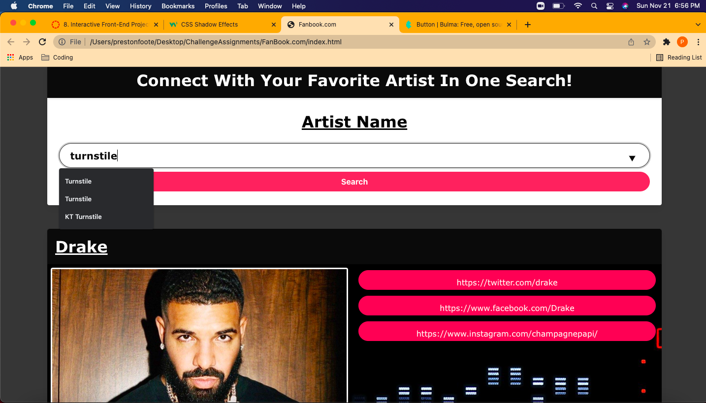
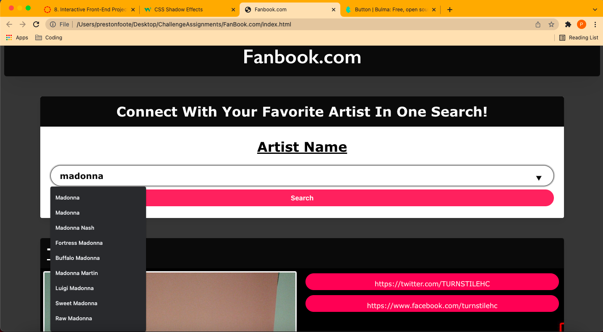

# FanBook.com

## Description

Group Project 1 for Full Stack Development Course with BootCampSpot

## User Story

```
As an Audiophile I am Looking to Find my favorite artist Most Recent Data 
When I Search my Favorite Artist 
Then I am Presented with My Favorite Artist's Most Recent Data
```

## Languages Used

* HTML
* CSS 
  * [Bulma](https://bulma.io/)
* Javascript
  * [jQuery](https://jquery.com/)

## URLs

* [GitHub repository](https://github.com/pwfoote/FanBook.com/)
* [Deployed website](https://pwfoote.github.io/FanBook.com/)

## Developers

* Preston Foote
* Patrick Hopps
* Isaac Andrade
* Tyreeze Weddington
* Colton Ward

## APIs Used

* [MusicBrainz API](https://musicbrainz.org/doc/MusicBrainz_API)
* [Discogs API](https://www.discogs.com/developers)

## Screenshots

_Example of searching for artist "Turnstile" with previous search of "Drake" on screen:_



_Example of searching for artist "Madonna" with previous search of "Turnstile" on screen:_

